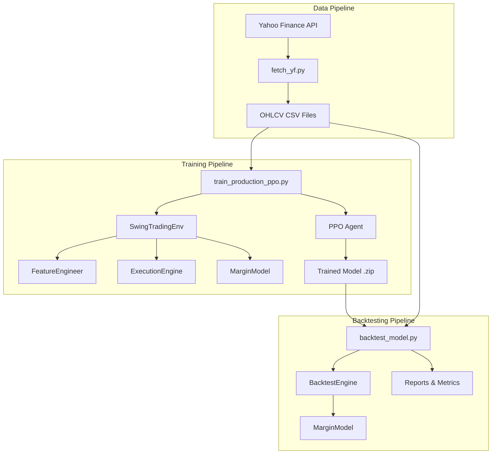
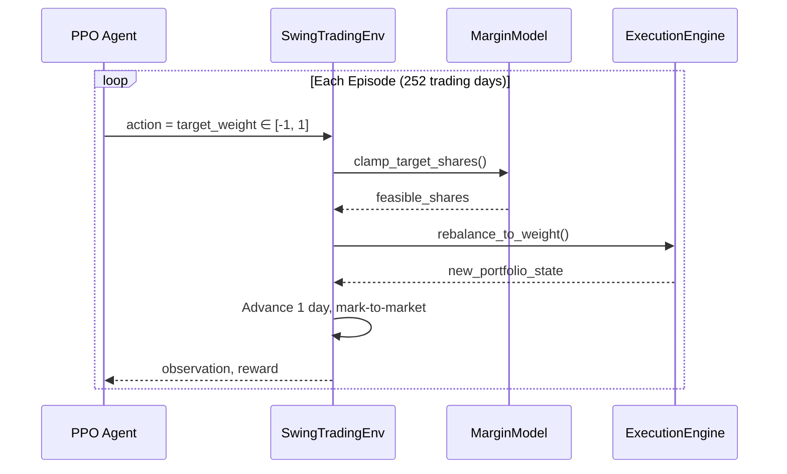

# RL Stock Trading with PPO - Production System

A **production-ready** reinforcement learning system for stock trading using Proximal Policy Optimization (PPO). This system is designed with institutional-grade risk management, realistic margin constraints, and comprehensive backtesting to ensure that models perform consistently from training through production deployment.

## Table of Contents

1. [System Overview](#system-overview)
2. [Architecture](#architecture)
3. [Data Pipeline](#data-pipeline)
4. [Training Pipeline](#training-pipeline)
5. [Backtesting Pipeline](#backtesting-pipeline)
6. [Configuration Reference](#configuration-reference)
7. [Preventing Train-Test Mismatch](#preventing-train-test-mismatch)
8. [Quick Start](#quick-start)
9. [Production Deployment](#production-deployment)
10. [Troubleshooting](#troubleshooting)

---

## System Overview

### What This System Does

This system trains a reinforcement learning agent (PPO) to make daily trading decisions for a single stock. The agent learns to:

1. **Observe** market features (returns, volatility, moving averages, volume)
2. **Decide** a target portfolio weight from -100% (full short) to +100% (full long)
3. **Execute** trades at the next market open with realistic transaction costs
4. **Learn** from rewards based on risk-adjusted returns

### Key Design Principles

> [!IMPORTANT]
> **Train-Backtest Consistency**: The #1 cause of production failures is when the backtest environment differs from training. This system is explicitly designed to enforce **identical constraints** in both environments.

| Principle | Implementation |
|-----------|---------------|
| **Cash-Only Longs** | Cannot buy more shares than cash allows (no borrowing) |
| **Short Proceeds Haircut** | Only 50% of short sale proceeds are usable as buying power |
| **Identical Execution** | Same transaction costs, margin rules in training and backtest |
| **Realistic Costs** | Default 7 bps total (5 bps fees + 2 bps slippage) |

---

## Architecture



### Directory Structure

```
RL-StockPrediction-PPO/
├── train_production_ppo.py    # Main training script
├── backtest_model.py          # Main backtesting script
├── fetch_yf.py                # Data download utility
│
├── swing_trading/             # Core trading environment
│   ├── config.py              # All configuration dataclasses
│   ├── environment.py         # Gymnasium RL environment
│   ├── features.py            # Feature engineering
│   ├── execution.py           # Trade execution engine
│   ├── margin.py              # Margin constraint enforcement
│   └── portfolio.py           # Portfolio state management
│
├── trading_system/            # Production infrastructure
│   ├── training/
│   │   ├── trainer.py         # PPOTrainer wrapper
│   │   └── callbacks.py       # TensorBoard, risk monitoring
│   ├── backtesting/
│   │   ├── backtest_engine.py # Simulation engine
│   │   └── report_generator.py# Report generation
│   └── config/
│       ├── training_config.py # PPO hyperparameters
│       └── risk_config.py     # Risk limits
│
├── yf_data/                   # Downloaded market data
├── models/                    # Saved trained models
├── reports/                   # Backtest reports
└── slurm_train_ppo.slurm      # HPC cluster job script
```

---

## Data Pipeline

### Step 1: Download Historical Data

Use `fetch_yf.py` to download OHLCV data from Yahoo Finance:

```bash
# Download 6 years of AAPL daily data
python fetch_yf.py --tickers AAPL --start 2020-01-01 --end 2026-01-22 --interval 1d

# Download multiple tickers
python fetch_yf.py --tickers AAPL MSFT GOOGL --start 2020-01-01 --end 2026-01-22
```

This creates CSV files in `yf_data/`:
```
yf_data/
└── AAPL_1d_2020-01-01_to_2026-01-22.csv
```

### Data Format

| Column | Description | Example |
|--------|-------------|---------|
| Date | Trading date | 2024-01-15 |
| Open | Opening price | 185.50 |
| High | Day's high | 187.25 |
| Low | Day's low | 184.80 |
| Close | Closing price | 186.90 |
| Volume | Shares traded | 45,123,456 |

### Train-Validation Split

Training automatically splits data **temporally** (not randomly) to prevent data leakage:

```
Full Data: 2020-01-01 to 2026-01-22 (1522 trading days)
           │
           ▼
┌─────────────────────────────────────┐──────────────────┐
│        Training (80%)               │  Validation (20%)│
│   2020-01 ─────────── 2024-09       │  2024-09 ─ 2026 │
│         ~1218 bars                  │    ~304 bars     │
└─────────────────────────────────────┘──────────────────┘
```

> [!CAUTION]
> **Never shuffle time-series data!** The model must learn from past data to predict future movements. Shuffling creates data leakage that produces unrealistically good training results that fail in production.

---

## Training Pipeline

### Step 2: Train the Model

```bash
# Production training (conservative, 2M timesteps)
python train_production_ppo.py --ticker AAPL --mode production

# Research training (aggressive, faster iteration)
python train_production_ppo.py --ticker AAPL --mode research --timesteps 500000

# Custom settings
python train_production_ppo.py --ticker AAPL \
    --mode production \
    --timesteps 1000000 \
    --gpu 0 \
    --seed 42 \
    --experiment aapl_v2
```

### What Happens During Training



### Key Training Outputs

After training completes, you'll find:

```
models/
└── aapl_production_v1_final.zip          # Trained PPO model
└── aapl_production_v1_final_vecnormalize.pkl  # Observation normalizer

runs/
└── aapl_production_v1/                   # TensorBoard logs
    └── PPO_0/
        └── events.out.tfevents.*
```

### Monitor Training with TensorBoard

```bash
tensorboard --logdir runs/aapl_production_v1
```

Key metrics to watch:
- `rollout/ep_rew_mean`: Average episode reward (should trend upward)
- `train/policy_loss`: Policy gradient loss
- `train/value_loss`: Value function loss
- `financial/sharpe_ratio`: Risk-adjusted returns

---

## Backtesting Pipeline

### Step 3: Backtest the Model

```bash
# Basic backtest
python backtest_model.py \
    --model models/aapl_production_v1_final \
    --ticker AAPL

# With date range
python backtest_model.py \
    --model models/aapl_production_v1_final \
    --ticker AAPL \
    --start-date 2024-01-01 \
    --end-date 2026-01-22

# Debug mode (see step-by-step decisions)
python backtest_model.py \
    --model models/aapl_production_v1_final \
    --ticker AAPL \
    --debug
```

### Backtest Outputs

```
reports/AAPL_backtest_20260123_120000/
├── executive_summary.html    # Visual summary with charts
├── trades.csv                # Complete trade log
├── equity_curve.png          # Portfolio value over time
└── monthly_returns.png       # Heatmap of monthly returns
```

### Understanding Backtest Metrics

| Metric | Good Value | Description |
|--------|------------|-------------|
| **Total Return** | > 0% | Net profit/loss percentage |
| **Sharpe Ratio** | > 1.0 | Risk-adjusted return (> 2.0 is excellent) |
| **Max Drawdown** | < 20% | Worst peak-to-trough decline |
| **Win Rate** | > 50% | Percentage of profitable trades |
| **Profit Factor** | > 1.5 | Gross profit / Gross loss |

---

## Configuration Reference

### Environment Configuration (`SwingTradingConfig`)

```python
@dataclass(frozen=True)
class EnvironmentConfig:
    initial_equity: float = 100_000.0    # Starting capital ($)
    lookback: int = 120                  # Days of history in observation
    episode_length: int = 252            # Trading days per episode
    random_start: bool = True            # Randomize episode start
```

### Trading Configuration (`TradingConfig`)

| Parameter | Default | Description |
|-----------|---------|-------------|
| `fee_rate` | 0.0005 (5 bps) | Transaction fee per trade |
| `slippage_rate` | 0.0002 (2 bps) | Slippage estimate |
| `allow_short` | True | Enable short selling |
| `max_abs_weight` | 1.0 | Max portfolio weight (1.0 = 100%) |
| `cash_only` | True | Require cash for longs |
| `turnover_penalty` | 0.0 | Penalty for excessive trading |

### Margin Configuration (`MarginConfig`)

| Parameter | Default | Description |
|-----------|---------|-------------|
| `short_proceeds_haircut` | 0.5 | Fraction of short proceeds locked |
| `initial_margin_long` | 1.0 | Required margin for longs (1.0 = cash-only) |

**How Margin Works:**

```
Example: You have $100,000 cash and short 100 shares at $100 each

Short Proceeds = 100 × $100 = $10,000

With 50% haircut:
  Usable Cash = $100,000 + (1 - 0.5) × $10,000 = $105,000
  Locked Amount = 0.5 × $10,000 = $5,000 (held as collateral)

Without haircut (unrealistic!):
  Usable Cash = $100,000 + $10,000 = $110,000
  ↑ This allows infinite leverage cycles
```

### PPO Hyperparameters (`PPOConfig`)

| Parameter | Production | Research | Description |
|-----------|------------|----------|-------------|
| `learning_rate` | 1e-4 | 5e-4 | Adam optimizer LR |
| `n_steps` | 4096 | 2048 | Steps per rollout |
| `batch_size` | 128 | 64 | Minibatch size |
| `n_epochs` | 5 | 15 | SGD epochs per update |
| `gamma` | 0.99 | 0.995 | Discount factor |
| `clip_range` | 0.1 | 0.3 | PPO clipping |
| `ent_coef` | 0.005 | 0.02 | Entropy bonus |

### Risk Configuration (`RiskConfig`)

| Parameter | Institutional | Research | Description |
|-----------|---------------|----------|-------------|
| `max_position_size` | 0.5 | 2.0 | Max position as fraction of equity |
| `max_leverage` | 1.0 | 5.0 | Maximum leverage |
| `max_drawdown_pct` | 0.15 | 0.50 | Stop training if exceeded |
| `max_daily_loss_pct` | 0.03 | 0.20 | Daily loss circuit breaker |

---

## Preventing Train-Test Mismatch

### The #1 Production Failure Mode

> [!CAUTION]
> **The most common cause of production failures is when the backtest engine differs from the training environment.** This creates models that look great on paper but fail catastrophically in the real world.

### How This System Prevents Mismatch

#### 1. Shared MarginModel

Both training and backtesting use the **exact same** `MarginModel` class:

```python
# In training (swing_trading/execution.py)
self.margin_model = MarginModel(margin_config)
clamped = self.margin_model.clamp_target_shares(...)

# In backtesting (trading_system/backtesting/backtest_engine.py)
self.margin_model = MarginModel(self.config.margin)
clamped = self.margin_model.clamp_target_shares(...)
```

#### 2. Identical Transaction Costs

| Cost Type | Training | Backtesting |
|-----------|----------|-------------|
| Fee Rate | 0.0005 | 0.001 (configurable) |
| Slippage | 0.0002 | Included in cost |
| **Total** | **7 bps** | **10 bps** |

> [!TIP]
> Backtesting uses slightly higher costs by default to be conservative. This ensures that if a strategy works in backtest, it should work in production.

#### 3. Cash Constraint Enforcement

The backtest engine now enforces the same cash constraints as training:

```python
# Before fix (BROKEN): Allowed unlimited leverage
target_shares = (target_weight * equity) / price  # Could be anything!

# After fix (CORRECT): Enforces cash-only constraint
target_shares = self.margin_model.clamp_target_shares(
    current_cash=self.cash,
    current_shares=self.position.shares,
    price=price,
    target_shares=target_shares,
    fee_rate=self.transaction_cost,
    slippage_rate=0.0,
    allow_short=self.allow_short,
)
```

#### 4. Debug Mode Verification

Always verify your backtest with debug mode:

```bash
python backtest_model.py --model models/my_model --ticker AAPL --debug
```

This shows step-by-step:
```
======================================================================
STEP 8 | 2020-06-19 00:00:00
======================================================================
  Raw Action:     1.000000
  Target Weight:  1.0000 (100.0%)
  Price:          $87.43
  ------------------------------
  Equity:         $102,001.96
  Cash:           $130,277.11
  Current Shares: -323.40
  ------------------------------
  Target Shares:  1166.67
  [!] CONSTRAINED: 1166.67 -> 1165.18    ← Margin constraint applied!
      Reduction:  0.1%
```

---

## Quick Start

### Prerequisites

```bash
# Create virtual environment
python -m venv .venv
.venv\Scripts\activate  # Windows
source .venv/bin/activate  # Linux/Mac

# Install dependencies
pip install -r requirements.txt
```

### Complete Workflow

```bash
# 1. Download data
python fetch_yf.py --tickers AAPL --start 2020-01-01 --end 2026-01-22

# 2. Train model (takes 30-60 minutes with GPU)
python train_production_ppo.py --ticker AAPL --mode production --timesteps 1000000

# 3. Backtest
python backtest_model.py --model stock_trading_logs/models/AAPL_production_*_final --ticker AAPL

# 4. Review results
# Open reports/AAPL_backtest_*/executive_summary.html
```

---

## Production Deployment

### HPC Cluster (SLURM)

Submit training job to cluster:

```bash
sbatch slurm_train_ppo.slurm
```

Monitor progress:
```bash
squeue -u $USER
tail -f /scratch/yuvraj17/stock_trading_logs/*.out
```

### Key SLURM Configuration

```bash
#SBATCH --gpus-per-node=1     # Request 1 GPU
#SBATCH --cpus-per-task=8     # 8 CPU cores
#SBATCH --time=00:30:00       # Time limit
```

### Model Versioning Best Practices

```
models/
├── AAPL_production_20260123_043341_final.zip
│   ↑ ticker   ↑ mode    ↑ timestamp
│
└── AAPL_production_20260123_043341_final_vecnormalize.pkl
    ↑ Required for inference! Contains observation statistics
```

> [!WARNING]
> **Always deploy both files together!** The VecNormalize file contains observation statistics computed during training. Without it, the model receives unnormalized observations and will perform poorly.

---

## Troubleshooting

### Common Issues

#### "Model goes bankrupt in backtest"

**Symptom**: Negative equity after few steps despite high win rate

**Cause**: Margin constraints not enforced in backtest (now fixed!)

**Solution**: Update to latest `backtest_engine.py` which integrates `MarginModel`

#### "CUDA not available"

**Symptom**: Training falls back to CPU, very slow

**Solution**:
```bash
# Check CUDA installation
python -c "import torch; print(torch.cuda.is_available())"

# On HPC cluster
module load cuda/12.2
```

#### "VecNormalize file not found"

**Symptom**: Backtest crashes or produces garbage results

**Solution**: Ensure both files are present:
```
my_model.zip                  # Model weights
my_model_vecnormalize.pkl     # Observation statistics
```

#### "Negative Sharpe ratio"

**Symptom**: Model performs worse than buy-and-hold

**Possible causes**:
1. Not enough training timesteps
2. Overly aggressive trading (high turnover)
3. Training data too short or non-representative

**Solutions**:
1. Increase `--timesteps` to 2M+
2. Add `turnover_penalty` to config
3. Use longer training period (5+ years)

---

## Summary of Key Constants

| Constant | Default Value | Location |
|----------|---------------|----------|
| Initial Capital | $100,000 | `EnvironmentConfig.initial_equity` |
| Transaction Fee | 5 bps (0.05%) | `TradingConfig.fee_rate` |
| Slippage | 2 bps (0.02%) | `TradingConfig.slippage_rate` |
| Short Haircut | 50% | `MarginConfig.short_proceeds_haircut` |
| Long Margin | 100% (cash-only) | `MarginConfig.initial_margin_long` |
| Max Position | 100% of equity | `TradingConfig.max_abs_weight` |
| Train-Val Split | 80/20 | `train_production_ppo.py` |
| Lookback Window | 120 days | `EnvironmentConfig.lookback` |
| Episode Length | 252 days | `EnvironmentConfig.episode_length` |
| PPO Learning Rate | 1e-4 (prod) / 5e-4 (research) | `PPOConfig.learning_rate` |
| Total Timesteps | 2M (prod) / 500K (research) | `TrainingConfig.total_timesteps` |

---

## License

MIT License - See LICENSE file for details.

## Citation

If you use this system for research, please cite:
```
@software{rl_stock_ppo,
  title = {RL Stock Trading with PPO},
  year = {2026},
  url = {https://github.com/17YuvrajSehgal/RL-StockPrediction-PPO}
}
```
