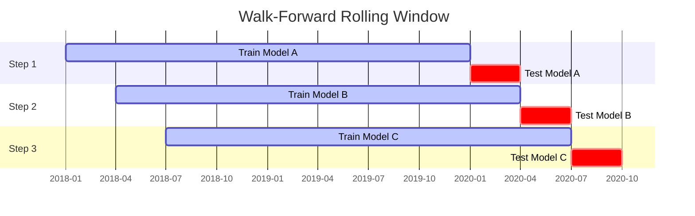

# Walk-Forward Validation Guide

## Overview

Walk-Forward Validation is the gold standard for testing algorithmic trading strategies. Unlike a standard backtest (Train on 2015-2020, Test on 2021-2022), Walk-Forward Validation tests how the model performs in a **continuous loop of re-adaptation**.

It answers the critical question: *"If I had used this system in production for the last 5 years, constantly re-training it on recent data, how would I have performed?"*

## Methodology: "Rolling Window"

Our implementation uses a **Rolling Window** approach with **Full Retraining**.

### 1. The Loop

We slide a window across the timeline:

| Step | Train Window (2 Years) | Test Window (3 Months) | Action |
| :--- | :--- | :--- | :--- |
| **0** | Jan 2018 - Jan 2020 | **Jan 2020 - Mar 2020** | Train Model A, Trade for 3 months |
| **1** | Apr 2018 - Apr 2020 | **Apr 2020 - Jun 2020** | Train Model B, Trade for 3 months |
| **2** | Jul 2018 - Jul 2020 | **Jul 2020 - Sep 2020** | Train Model C, Trade for 3 months |
| ... | ... | ... | ... |

### 2. Retraining vs. Fine-Tuning

**We use Full Retraining (New Model Every Time).**

*   **Retraining (Our Approach)**: At Step 1, we initialize a *fresh* random model and train it from scratch on Apr 2018-Apr 2020.
    *   **Pros**: Prevents "baggage". The model adapts 100% to the new regime. If the market shifts from Bull to Bear, the model isn't stuck with "Bull Market Biases" from 2017.
    *   **Cons**: Slower (needs full training every step).

*   **Fine-Tuning (Alternative)**: At Step 1, we take Model A and just train it a bit more on the new data.
    *   **Pros**: Faster.
    *   **Cons**: Catastrophic Forgetting and Bias. The model often gets "confused" or stuck in old patterns. In RL, starting fresh is usually safer for regime adaptation.

## Interpretation of Results

The final "Walk-Forward Equity Curve" is stitched together from the "Test Window" of each step.

*   **If the curve is up**: The strategy successfully *adapts* to changes. It learned the 2020 crash in time to short it, and learned the 2021 rally in time to buy it.
*   **If the curve is down**: The strategy is "too slow". By the time it learns a trend (during the 2-year train window), the trend is over (in the 3-month test window).

## "Berkshire Hathaway" Mode (Institutional Configurations)

To run this strategy at an institutional level (where compute power is unlimited and profit maximization is the only goal), use the following configuration:

### 1. Massive Training Convergence
*   **Parameter**: `timesteps`
*   **Setting**: `1,000,000` to `5,000,000` steps per window.
*   **Why**: RL models (PPO) are data-hungry. 20k steps is a "sketch"; 1M steps is a "photograph". Converging the policy ensures the model isn't just acting randomly due to insufficient gradients.

### 2. Micro-Adaptation
*   **Parameter**: `test_months` (Re-training frequency)
*   **Setting**: `1 Month` or `1 Week`.
*   **Why**: Markets change fast. Training on 2 years and predicting for 6 months (default) is risky. Retraining every week ensures the model is always calibrated to the *immediate* volatility regime (e.g. VIX changes).

### 3. Ensemble Voting
*   **Parameter**: `seeds`
*   **Setting**: Train 5 separate agents (seeds 42, 43, 44, 45, 46) for *each* window and average their actions.
*   **Why**: Removes "random luck". If 4/5 agents say "Buy", it's a strong signal. If 2 say "Buy" and 3 say "Sell", stay neutral.

### 4. Feature Engineering
*   **Requirement**: Inputs must include Macro (Interest Rates, VIX), Fundamentals (P/E Ratio), and Micro-structure (Order Flow).
*   **Current State**: We currently use Technicals (RSI, MACD, BB). Adding Macro data would be the next "Berkshire" upgrade.

## Visualizing the Process

